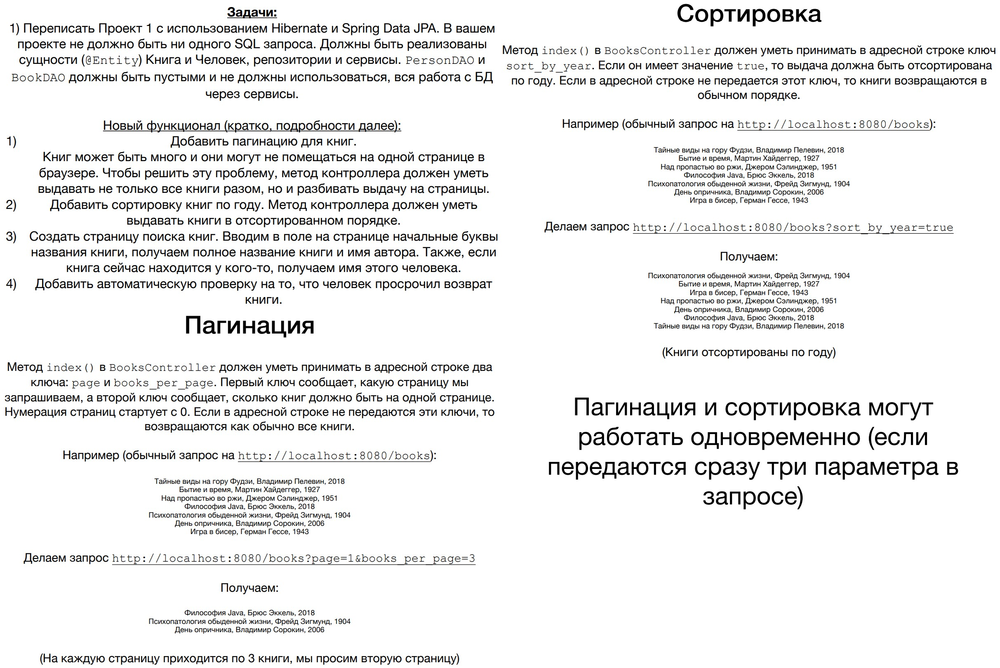
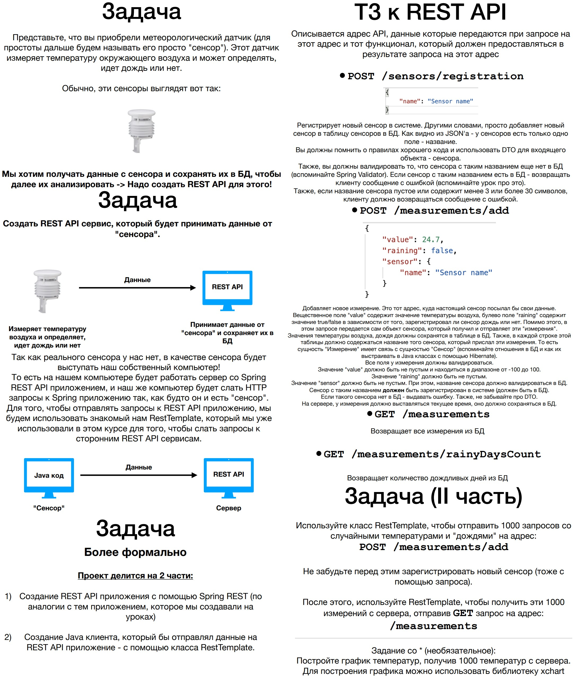

# spring-project

Я прошла курс ["Spring - Полный курс. Boot, Hibernate, Security, REST"](https://www.udemy.com/course/spring-alishev/), 
преподаватель Наиль Алишев, платформа Udemy.com. Процесс прохождения размещался в этом репозитории.

В ходе обучения были выполнены три учебных проекта.

## project1

---

Функционал реализован в полном объёме.

Приложение устанавливается на Tomcat-9, разворачивается в контекстном пути http://localhost:8080/library

Использованные технологии: Java 11 SE, Apache Maven, Apache Tomcat, JDBC, PostgreSQL, Spring Core, Spring MVC, Lombok,
Thymeleaf, HTML, CSS.

---

Титульные страницы:

Создание и редактирование читателя (с валидацией):

Создание и редактирование книги (с валидацией):

Профиль читателя, профиль книги, освобождение книги при удалении читателя:

## project2

---

Функционал реализован в полном объёме.

Приложение устанавливается на Tomcat-9, разворачивается в контекстном пути http://localhost:8080/library

Использованные технологии: Java 11 SE, Apache Maven, Apache Tomcat, PostgreSQL, Hibernate, Spring Core, Spring MVC,
Spring Data, Lombok, Thymeleaf, HTML, CSS.

---

Основной CRUD-функционал приложения не изменился.

Чтобы не вводить вручную параметры в адресную строку, я добавила в представление для книг форму ввода параметров 
сортировки/паджинации:

Страница поиска книг:

Если читатель взял книгу более 10 дней назад, книга считается просроченной и подсвечивается на его странице красным
цветом. Для демонстрации решения я воспользовалась SQL-запросом, вручную заменив дату взятия книги. Видео записывалось
15 октября 2022 года.

### project2.5

В папке project2Boot находится проект №2, переписанный на Spring Boot.

Приложение собирается в jar-файл, запускается из метода main, разворачивается в контекстном пути 
http://localhost:8080/library

Также возможен запуск из командной строки. Файл project2Boot.jar в папке target: java -jar project2Boot.jar

## project3

---

Функционал реализован в полном объёме.

RestClient я реализовала не так, как это сделал преподаватель. В его реализации для парсинга полученных показаний 
используются такие же DTO, как и в RestAPI. У меня же реализован парсинг из строки с помощью регулярного выражения.

Приложение собирается в jar-файл, запускается из метода main.

Использованные технологии: Java 11 SE, Apache Maven, Apache Tomcat, PostgreSQL, Hibernate, Spring Core, Spring MVC,
Spring Data, Spring Boot, Spring Web, Lombok, XChart.

---

С картинками в этом проекте сложно, так как UI не реализовывался. Не снимать же скриншоты Postman :smile:! Лучшее,
что я смогла придумать, это показать, как из пустых, только что созданных таблиц в базе данных RestAPI через 
запуск RestClient создаётся график тысячи случайных температур.

