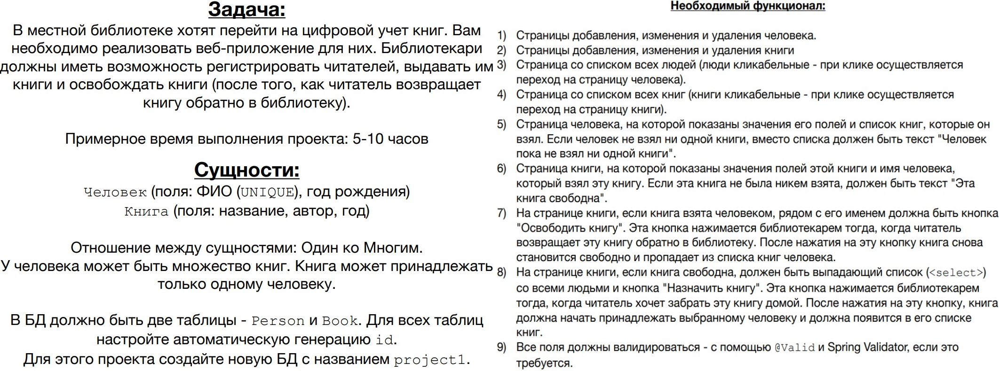

# spring-project

 Я прохожу курс <a href="https://www.udemy.com/course/spring-alishev/">
"Spring - Полный курс. Boot, Hibernate, Security, REST"</a> , преподаватель Наиль Алишев, платформа Udemy.com. 
Процесс и результаты буду размещать в этом репозитории.

Вообще, конечно, все эти темы я проходила на курсе Java Enterprise Development в IT-Academy, и в выпускном проекте
их применяла. Но это было "галопом по Европам", на каждую технологию одно-два занятия. Сейчас хочу разобраться в 
Spring подробно и не спеша. Повторить старое и, вероятно, узнать что-то новое.

В ходе обучения заявлены три учебных проекта. По мере выполнения буду их выкладывать.

# project1

Функционал реализован в полном объёме.

Приложение устанавливается на Tomcat-9, разворачивается в контекстном пути http://localhost:8080/library

Использованные технологии: Java 11 SE, Apache Maven, Apache Tomcat, JDBC, PostgreSQL, Spring Core, Spring MVC, 
Thymeleaf, HTML, CSS.

Титульные страницы:

Создание и редактирование читателя (с валидацией):

Создание и редактирование книги (с валидацией):

Профиль читателя, профиль книги, освобождение книги при удалении читателя:

