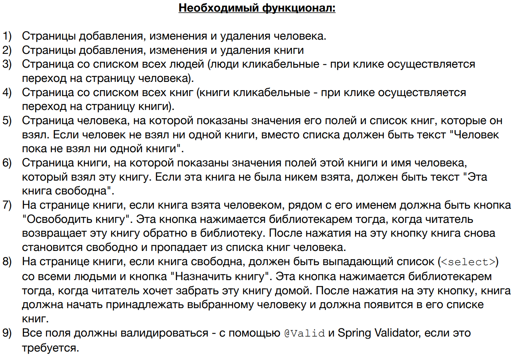

Функционал реализован в полном объёме.

Приложение устанавливается на Tomcat-9, разворачивается в контекстном пути http://localhost:8080/library

Использованные технологии: Java 11 SE, Apache Maven, Apache Tomcat, JDBC, PostgreSQL, Spring Core, Spring MVC, 
Thymeleaf, HTML, CSS.

<i>(*) Если gif-картинки не отображаются, обновите страницу, и они загрузятся.</i>

Титульные страницы:

Создание и редактирование читателя (с валидацией):

Создание и редактирование книги (с валидацией):

Профиль читателя, профиль книги, освобождение книги при удалении читателя:

